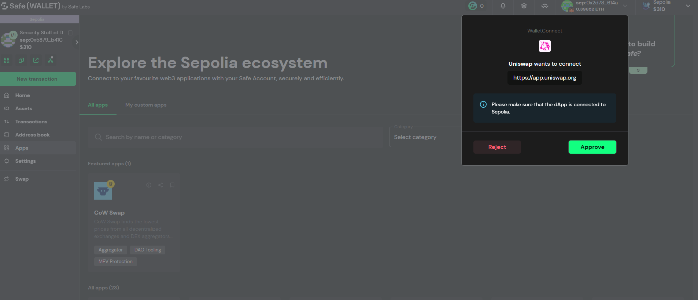

## Advanced-Web3-Wallet-Security

- A foundational overview to Navigating the Path to a Qualified Signer: An Introduction to Advanced Wallet Operations - This curriculum empowers aspiring Qualified Signers with critical skills for secure advanced wallet operations.

### Navigating the Path to a Qualified Signer: An Introduction to Advanced Wallet Operations

- This program is designed for individuals who are, or aspire to be, responsible for managing and securing funds through complex blockchain transactions. If your role involves operating within multi-signature (multi-sig) wallet environments or authorizing significant asset movements, this course will equip you with the critical skills needed to operate with confidence and security.

### Setting up A Safe Wallet

- Setting up a safe wallet for testing txn using sepolia testnet.
- Verified sent tnx using block explorer and cross checking the proxy contract ,deployed original contract similarity , who the deployer was and when.
- learned how to interact with different Dapps like uniswap using our safe wallet securly.
- Must Understand and know that on which chain your Safe Accounts is deployed , crucial for interacting with different Dapps!
- 

### How sending tnx looks like using safe wallet

- When I tried sending a transaction using an address / ENS already linked to my Safe, it automatically flagged:

- Previous interactions
- Address book history
- Risk-related context

- With Safe, you can send multiple transactions to multiple recipients in a single transaction, which isn’t possible with a standard EOA wallet.
