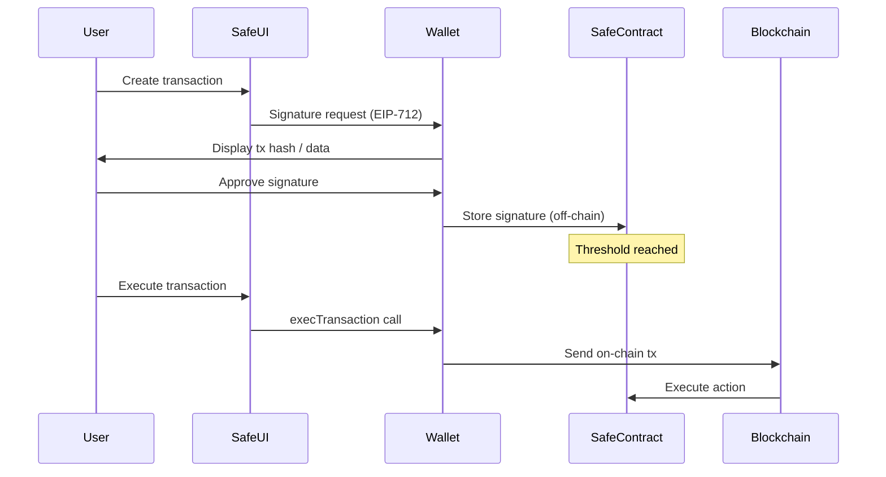

# Transaction Flow Diagrams

This section visualizes Safe{Wallet} transaction flows and attack surfaces.

---

## Safe{Wallet} Two-Step Flow

```mermaid
sequenceDiagram
    participant User
    participant SafeUI
    participant Wallet
    participant SafeContract
    participant Blockchain

    User->>SafeUI: Create transaction
    SafeUI->>Wallet: Signature request (EIP-712)
    Wallet->>User: Display tx hash / data
    User->>Wallet: Approve signature
    Wallet->>SafeContract: Store signature (off-chain)

    Note over SafeContract: Threshold reached

    User->>SafeUI: Execute transaction
    SafeUI->>Wallet: execTransaction call
    Wallet->>Blockchain: Send on-chain tx
    Blockchain->>SafeContract: Execute action
```
