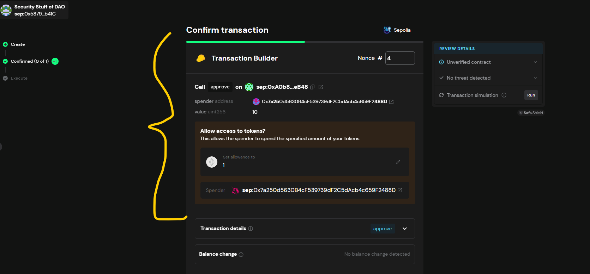
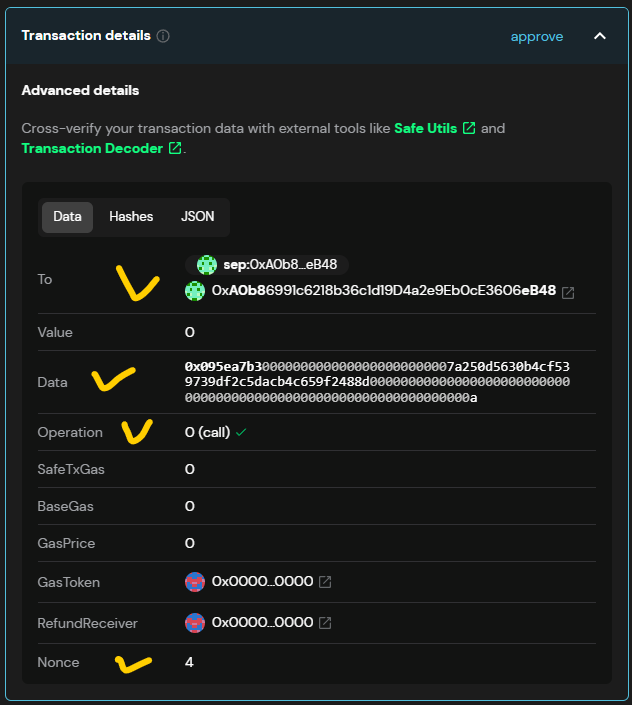
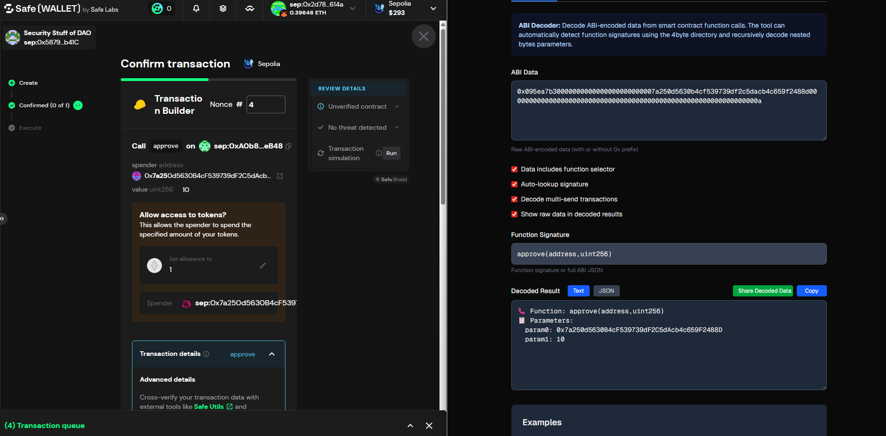
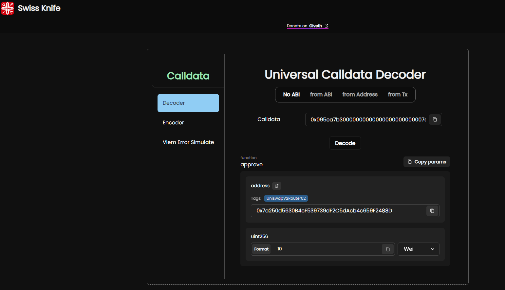
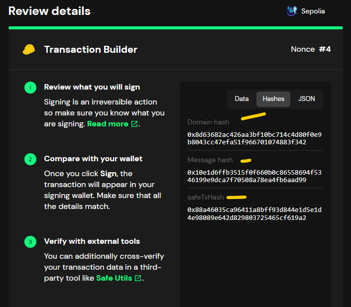

## Confirm transaction

- We are trying to approve 10 USDC on Uniswap v2 Router
- From the tx builder check the function approve() , spender address , the value in uint256

- Also check the ABI where you build the tx builder

# Transaction Details

## Advanced details

- Data (use to decode it and find out the receiver address and the amount ,because its encoded as a parameter on the calldata)
- for example:
- "0x095ea7b30000000000000000000000007a250d5630b4cf539739df2c5dacb4c659f2488d000000000000000000000000000000000000000000000000000000000000000a"

- Operation either 0 or 1 must be checked it can be DELEGATE
- Nounce :4

## Shows case image

-

# Tools to verify and decode calldata

- tools.cyfrin.io

### Option II paste the calldata on the swiss knife and you will get the same result of the decoded data , the spender address

- 

- So how about Message hash and domain hash
- To find out this just go to Hashes section on the advance txn details
- 
