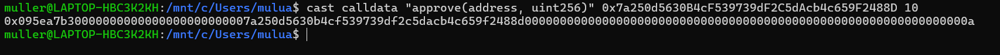
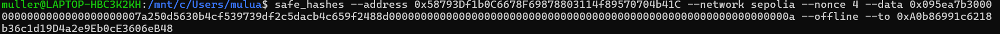
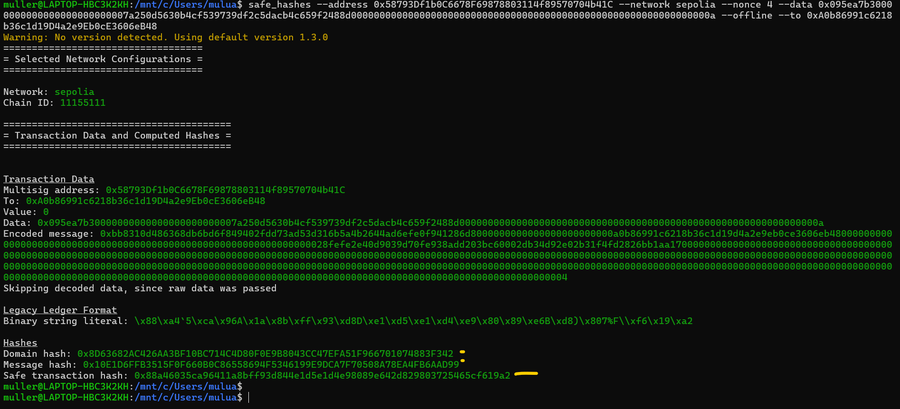
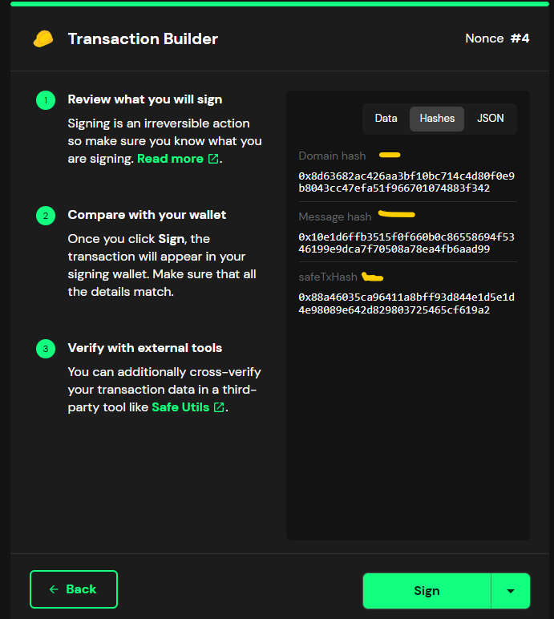

## Confirm transaction

- We are trying to approve 10 USDC on Uniswap v2 Router
- From the tx builder check the function approve() , spender address , the value in uint256

- approve() --> this function sets a fiat token allowance for a spender to spend on behalf of the caller , and it takes , the spender address, and the amount of the token in uint256 type

- Also check the ABI where you build the tx builder

# Transaction Details

## Advanced details

- Data (use to decode it and find out the receiver address and the amount ,because its encoded as a parameter on the calldata)
- for example:
- "0x095ea7b30000000000000000000000007a250d5630b4cf539739df2c5dacb4c659f2488d000000000000000000000000000000000000000000000000000000000000000a"

- Operation either 0 or 1 must be checked it can be DELEGATE
- Nounce :4

## Shows case image

-

# Tools to verify and decode calldata

- tools.cyfrin.io

### Option II paste the calldata on the swiss knife and you will get the same result of the decoded data , the spender address

- 

- So how about Message hash and domain hash
- To find out this just go to Hashes section on the advance txn details
- 

## cast calldata

- We can use cast calldata to fetch the calldata and compare it
- 

## the best way to see all the details under

- We pass the raw data instead of trustin and getting it from API
- here we need to stay --offline and attach the USDC address to it
- 

- The result will be intersting
  
- Finally now we can compare the safe txn hash , message hash , domain hash , it the same so we can sign now .
- attacjed below for comparison.

- 
